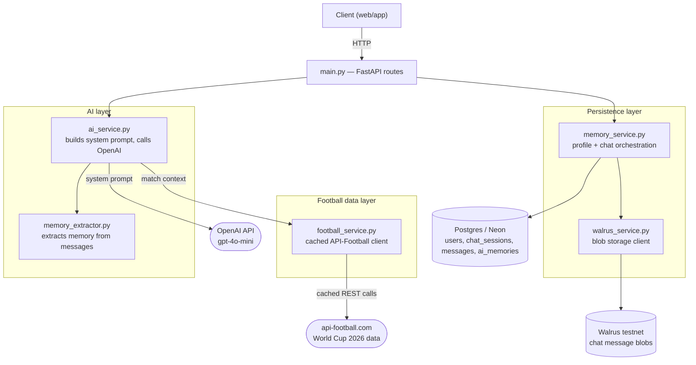
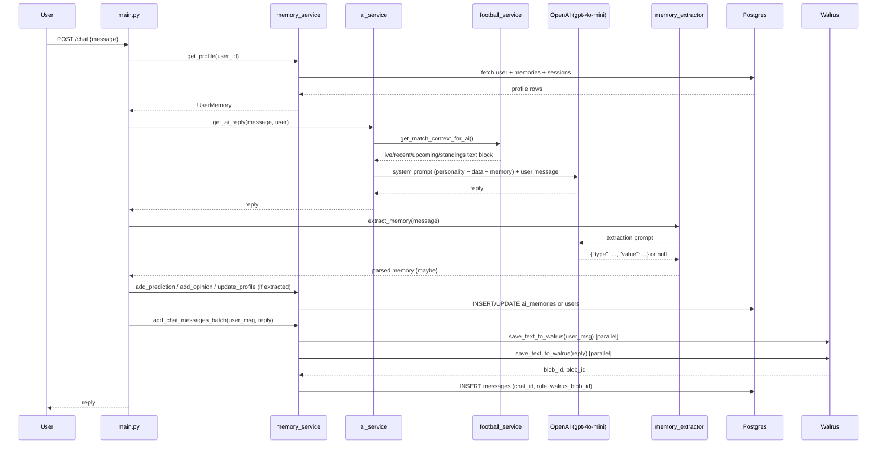
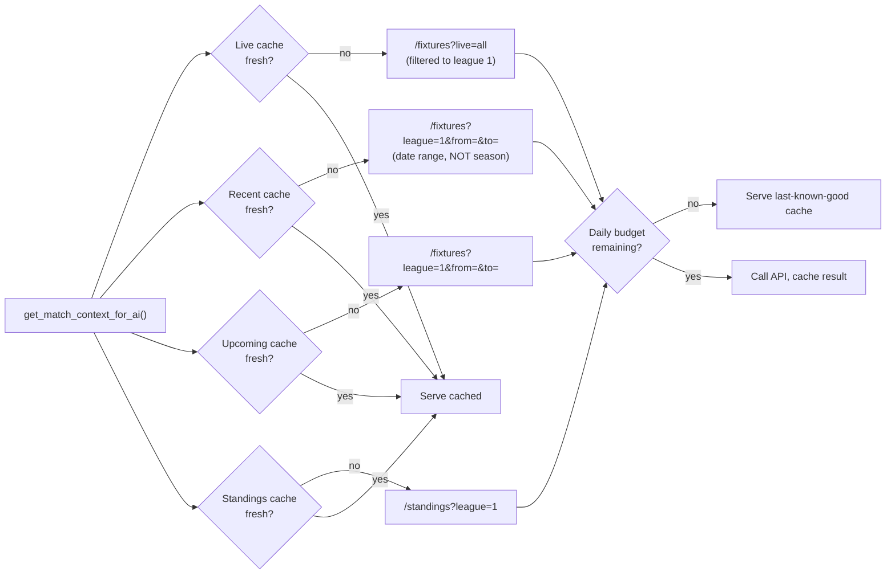
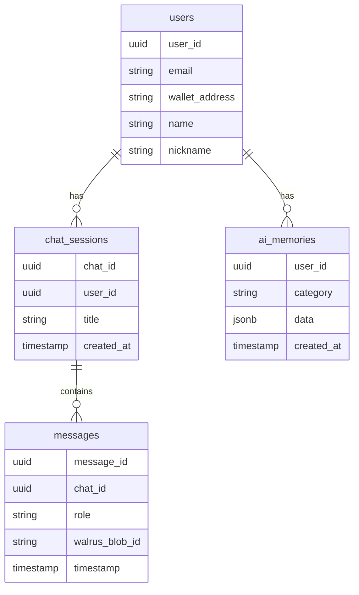

# TRIGO-AI — World Cup 2026 Football Companion

TRIGO-AI is a chat backend that pairs an OpenAI-powered "football mate" persona with **live World Cup 2026 data** and **persistent per-user memory** (predictions, opinions, favourite club/player/country). It remembers who you support, what you predicted, and roasts (gently) or celebrates you when results come in — grounded in real fixtures, not invented ones.

This README documents the services that exist in this codebase and how they fit together. The FastAPI route layer (`main.py`) wasn't part of this review, so exact endpoint signatures aren't documented here beyond what's been directly observed (`POST /register/email`, plus the auto-generated `/docs` and `/openapi.json`) — the live, authoritative route list is always visible at `/docs` (Swagger UI) once the app is running.

---

## 1. Architecture overview

**Why a hybrid Postgres + Walrus store?** Structured, frequently-queried fields (name, predictions, club, standings-relevant stuff) live in Postgres for fast relational lookups. Full chat message *text* is pushed to Walrus (decentralized blob storage) and only a `walrus_blob_id` reference is kept in the `messages` table — keeping the Postgres rows small while still letting the database answer "which sessions does this user have" instantly.

---

## 2. A single chat message, end to end

Two things worth calling out from that flow:
- **Memory extraction and the AI reply are independent** — a bad/failed extraction (e.g. `OPENAI_API_KEY` missing) never blocks the chat reply itself; `extract_memory()` returns `None` safely.
- **The two message saves to Walrus run in parallel** (`ThreadPoolExecutor`, 2 workers) rather than sequentially, to halve worst-case latency when Walrus is slow.

---

## 3. Football data pipeline (`football_service.py`)

Source: **API-Football v3** (`v3.football.api-sports.io`), World Cup 2026 = `league=1`.

### Per-resource caching

A single global cache timer would force every resource to refetch together even though they change at wildly different rates. Instead, each resource has its own TTL:

| Resource | TTL | Why |
|---|---|---|
| Live matches | 90s | Only matters while a match is actually on |
| Recent results | 15 min | Changes only when a match finishes |
| Upcoming fixtures | 1 hour | The schedule barely moves hour to hour |
| Standings | 15 min | Updates once per finished match |
| **Lineups (finished matches)** | **Forever**, keyed by fixture ID | Immutable once published — never refetched |

### Daily request budget guard

The free API-Football plan allows **100 requests/day**. `football_service.py` self-throttles at a configurable `DAILY_REQUEST_BUDGET` (default **90**, leaving headroom) — once hit, calls are skipped for the rest of the day and the last good cached data is served instead of hammering the provider into a 429.

### Known free-plan constraints (confirmed against live errors, not assumptions)

| Constraint | Symptom | Workaround in this code |
|---|---|---|
| `season=2026` rejected outright on `/fixtures` and `/standings` | `{'plan': 'Free plans do not have access to this season, try from 2022 to 2024.'}` | `recent`/`upcoming` query by **date range** (`from`/`to`) instead of `season` — confirmed to still return real 2026 WC matches. **Standings has no date dimension, so it may simply be unavailable on free tier** — it degrades to an empty list rather than crashing if so. |
| `live=<single id>` rejected | `{'live': 'The Live field does not match the regular expression...'}` | Use `live=all` and filter the response to `league.id == 1` client-side. |
| Lineups only published ~20–40 min pre-kickoff | Empty `response: []` for early/future fixtures | Only fetched for **live matches** + the **single most recent finished match** (not all 5 recent results) — caps the extra cost per cache cycle and avoids repeatedly polling matches with no lineup yet. |

---

## 4. AI personality & data grounding (`ai_service.py`)

The system prompt sent to `gpt-4o-mini` is assembled from three layers:

1. **Personality** — a chatty "football mate" tone (warm first, expert second), with light, friendly banter about predictions — not a stats report.
2. **Live football context** — injected from `football_service.get_match_context_for_ai()`, explicitly tagged `[LIVE DATA — snapshot taken HH:MM UTC]` or `[NO LIVE DATA AVAILABLE]` so the model always knows how fresh (or absent) its data is.
3. **User memory** — name, nickname, favourite club/player, supported country, recent predictions/opinions, pulled from `UserMemory`.

A **Data Accuracy Guidance** block instructs the model to treat the live data block as more reliable than its own training knowledge (which predates this tournament entirely), and to avoid stating an unconfirmed 2026 score/lineup/standing as fact — while still allowing normal conversation, opinions, and historical football knowledge (1930–2022) without hedging.

`temperature=0.4` is set on the main reply call to keep factual claims more consistent; the personality comes from the prompt content itself, not from sampling randomness.

---

## 5. Persistence layer (`memory_service.py` + `walrus_service.py`)

### Postgres schema (inferred from queries used)

- `users` holds account-level fields directly (`name`, `nickname`).
- `ai_memories` is a flexible category/value store for everything else: single-value fields (`favorite_club`, `favorite_player`, `supported_country` — deleted and re-inserted on update) and append-only lists (`prediction`, `opinion`).
- `messages` stores **only metadata** — the actual text content lives in Walrus, referenced by `walrus_blob_id`.

### Connection handling

A `psycopg2` connection pool (1–10 connections) talks to a Neon-hosted Postgres instance. Because Neon can silently close idle connections server-side, every checkout probes the connection with a cheap `SELECT 1` and transparently swaps in a fresh one if it's dead — avoiding a class of "connection already closed" errors that would otherwise surface randomly.

### Walrus usage

Two storage patterns exist in `walrus_service.py`:
- `save_text_to_walrus` / `load_text_from_walrus` — raw chat message text, used per-message (the active path in `memory_service`).
- `save_memory_to_walrus` / `load_memory_from_walrus` — serializes a whole `UserMemory` profile to one blob (available, but whether `main.py` actively uses this path wasn't confirmed in this review).

When loading a full chat history, message blobs are fetched **in parallel** via `ThreadPoolExecutor` (up to 10 workers) instead of one at a time — turning N sequential Walrus round-trips into one concurrent batch.

---

## 6. Environment variables

| Variable | Used by | Notes |
|---|---|---|
| `DATABASE_URL` | `memory_service.py` | Neon/Postgres connection string |
| `OPENAI_API_KEY` | `ai_service.py`, `memory_extractor.py` | App boots and runs without it — AI features degrade to a placeholder message instead of crashing |
| `FOOTBALL_API_KEY` | `football_service.py` | **api-sports.io key**, not a football-data.org token — not interchangeable |
| `WC_SEASON` | `football_service.py` | Defined for future use once on a paid plan that allows explicit `season=2026`; currently unused since free-tier date-range queries bypass it |
| `FOOTBALL_API_DAILY_BUDGET` | `football_service.py` | Default `90`; self-imposed ceiling under the real 100/day free-tier limit |
| `WALRUS_PUBLISHER_URL` / `WALRUS_AGGREGATOR_URL` | `walrus_service.py` | Default to the public Walrus testnet endpoints |

---

## 7. Testing

- `test_memory.py` — manual smoke test: creates a profile, updates fields, adds a prediction/opinion, re-fetches by email.
- `test_extractor.py` — runs a fixed set of sample messages through `extract_memory()` and prints what got extracted.

Both are standalone scripts (not pytest suites) — run directly with `python test_memory.py` / `python test_extractor.py` against a configured `DATABASE_URL`/`OPENAI_API_KEY`.

---

## 8. Known limitations / next steps

- **World Cup standings may be unavailable on the free API-Football plan** for the 2026 season specifically — confirmed blocked when requested via `season`; untested whether omitting it entirely (current code) succeeds or simply fails the same way. Worth checking logs for a `'plan'` error on the `standings` cache key.
- **No fact-verification pass on AI replies** — the model is instructed to ground itself in the live data block, but nothing double-checks its output afterward. A second, cheaper verification call could catch any claim that slips through, at the cost of extra latency and OpenAI spend on every message.
- **`main.py` route layer wasn't reviewed** — this document describes the service layer; for exact request/response shapes per endpoint, check `/docs` on a running instance.
